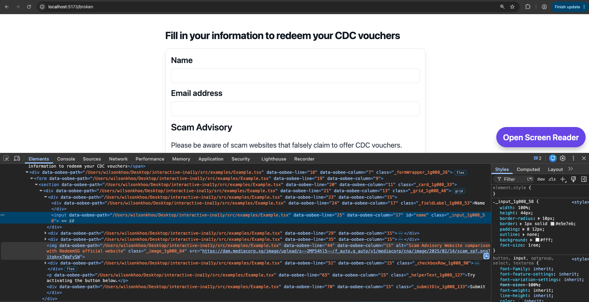
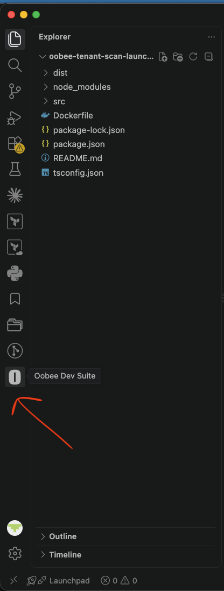

# 🧬 oobee-genome

Automatic source location tracking for DOM elements across multiple build tools.


## 🎯 What This Guide Solves

1. Install `@govtechsg/oobee-genome` from npm.
2. Pick your framework/build tool and wire it up quickly.
3. Keep production deployments clean by using a separate dev-only build config.


## 2. 📦 Installation

```bash
npm install @govtechsg/oobee-genome
```


<h3 style="color: red;">⚠️ Do Not Ship oobee-genome to Production</h3>

> [!CAUTION]
> **@govtechsg/oobee-genome is for development/debugging only. Never ship it in production builds.**
>
> Keep this in mind throughout the setup:
> - Your **production config** (`vite.config.js`, `next.config.js`, etc.) must never include oobee.
> - Always create a **separate** dev-only config file (e.g. `vite.config.oobee.ts`, `webpack.config.oobee.js`, `next.config.oobee.js`).
> - Use `npm run dev:oobee` for local debugging, and `npm run build` for all production builds.


## 3. 🛠️ Choose Your Framework / Build Tool

Select your framework below. Click to expand and follow the step-by-step setup.

**Available frameworks:**

- Vite (React, Vue)
- Webpack (React, Vue)
- Next.js

<details>
<summary><strong>Vite (React, Vue)</strong></summary>

### ⚡ Vite (React, Vue)

<span style="color: red; font-size: 1.1em;">**Important:** Always use `npm run build` for production. It uses the original `vite.config.ts`, never the oobee config.</span>

**Setup in 3 steps:**

**Step 1: Install**

```bash
npm install @govtechsg/oobee-genome
```

**Step 2: Create dev-only config**

Copy your existing `vite.config.ts` (or `.js`) to `vite.config.oobee.ts`, then add the oobee plugin:

```ts
import { defineConfig } from "vite";
import { oobeeVitePlugin } from "@govtechsg/oobee-genome/adapters/vite";
import react from '@vitejs/plugin-react'

export default defineConfig({
  plugins: [oobeeVitePlugin({ verbose: true }), react()],
});
```

**Step 3: Update package.json scripts**

Add these scripts to your `package.json`:

```json
{
  "scripts": {
    "dev:oobee": "vite --config vite.config.oobee.ts"
  }
}
```

**Run dev with oobee enabled:**

```bash
npm run dev:oobee
```

</details>

<details>
<summary><strong>Webpack (React, Vue)</strong></summary>

### 📦 Webpack (React, Vue)

<span style="color: red; font-size: 1.1em;">**Important:** Always use `npm run build` for production. It uses the original `webpack.config.js`, never the oobee config.</span>

**Setup in 3 steps:**

**Step 1: Install**

```bash
npm install @govtechsg/oobee-genome
```

**Step 2: Create dev-only config**

Copy existing `webpack.config.js` to `webpack.config.oobee.js`, then add the oobee loader rule:

```js
module.exports = {
  module: {
    rules: [
      {
        test: /\.[jt]sx?$/,
        exclude: /node_modules/,
        enforce: "pre",
        use: [
          {
            loader: require.resolve("@govtechsg/oobee-genome/adapters/webpack"),
            options: { verbose: true },
          },
        ],
      },
    ],
  },
};
```

**Step 3: Update package.json scripts**

Add these scripts to your `package.json`:

```json
{
  "scripts": {
    "dev:oobee": "webpack serve --mode development --config webpack.config.oobee.js"
  }
}
```

**Run dev with oobee enabled:**

```bash
npm run dev:oobee
```

</details>

<details>
<summary><strong>Next.js</strong></summary>

### ▲ Next.js

<span style="color: red; font-size: 1.1em;">**Important:** Never commit `next.config.js` changes that include oobee. Your production builds must always use the original config.</span>

**Setup in 3 steps:**

**Step 1: Install**

```bash
npm install @govtechsg/oobee-genome
```

**Step 2: Create dev-only config**

Copy your existing `next.config.js` to `next.config.oobee.js` and wrap your config with the oobee plugin:

```js
const { withOobeeDNA } = require("@govtechsg/oobee-genome/adapters/next");

const nextConfig = {
  reactStrictMode: true,
};


module.exports = withOobeeDNA(nextConfig, {
  verbose: true,
  enabled: true,
});

```

**Step 3: Update package.json scripts**

Add this script to your `package.json`:

```json
{
  "scripts": {
    "dev:oobee": "cp next.config.oobee.js next.config.js && next dev"
  }
}
```

**Run dev with oobee enabled:**

```bash
npm run dev:oobee
```

**After debugging:**
After you're done with local analysis/debugging, restore your original `next.config.js`:

```bash
git checkout next.config.js
```

or copy it from your version control.

</details>

<details>
<summary><strong>Vanilla HTML/CSS/JS (No Framework)</strong></summary>

### 🌐 Vanilla HTML/CSS/JS (No Framework)

For pure HTML/CSS/JavaScript projects. **Two approaches available:**


#### 📋 Approach 1: Copy-Paste Script (Simplest - No npm/Node Required)

Perfect for **static HTML, PHP, static site generators**, or any non-Node project.

**Step 1: Copy the injector script**

Download or copy `oobee-injector.js` from this repo into your project:

```bash
# Option A: Copy from @govtechsg/oobee-genome repo
cp node_modules/@govtechsg/oobee-genome/oobee-injector.js your-project/

# Option B: Or download directly
# Visit: https://raw.githubusercontent.com/oobee/oobee-genome/main/oobee-injector.js
```

**Step 2: Add to your HTML**

Add this line before closing `</body>`:

```html
<!DOCTYPE html>
<html>
<head>
  <title>My Project</title>
  <link rel="stylesheet" href="styles.css">
</head>
<body>
  <!-- Your content here -->
  
  <script src="oobee-injector.js"></script>
</body>
</html>
```

**Step 3: Done!**

- Open your HTML file in a browser (works with `file://` protocol)
- Open DevTools (F12) and inspect any element
- Look for `data-oobee-*` attributes ✅


**What gets injected:**

Each element receives:
- `data-oobee-file` - Current page URL
- `data-oobee-element` - Element selector (tag#id.class)
- `data-oobee-index` - Position in DOM
- `data-oobee-timestamp` - ISO timestamp

**Works with dynamic elements:** The script watches for new elements added via JavaScript and automatically injects attributes.


#### 🔨 Approach 2: NPM + esbuild Build (For Node Projects)

For projects with `package.json` and a build process.

**Step 1: Install**

```bash
npm install --save-dev esbuild @govtechsg/oobee-genome
```

**Step 2: Create dev build script**

Create `build.oobee.mjs`:

```js
import esbuild from 'esbuild';
import fs from 'fs';

// Copy injector to dist
fs.copyFileSync(
  'node_modules/@govtechsg/oobee-genome/oobee-injector.js',
  'dist/oobee-injector.js'
);

// Bundle JavaScript
await esbuild.build({
  entryPoints: ['src/index.js'],
  bundle: true,
  outdir: 'dist',
  sourcemap: true
});

// Copy HTML and CSS
fs.copyFileSync('src/index.html', 'dist/index.html');
fs.copyFileSync('src/styles.css', 'dist/styles.css');

console.log('✅ Build complete with oobee-genome!');
```

**Step 3: Update package.json scripts**

```json
{
  "scripts": {
    "dev": "npx http-server src -p 8080 -o",
    "build": "npm run build:prod",
    "build:prod": "esbuild src/index.js --bundle --outdir=dist"
  }
}
```

**Step 4: Run dev with oobee**

```bash
npm run dev
```

Then:
1. Open http://localhost:8080
2. Open DevTools (F12)
3. Inspect elements → see `data-oobee-*` attributes

**For production:** Use `npm run build` which builds without oobee.


#### 🤔 Which Approach to Use?

| Approach | Use When | Pros | Cons |
|----------|----------|------|------|
| **Copy-Paste Script** | Static HTML, PHP, no build process | Simple, no npm, works anywhere | Manual script management |
| **NPM + esbuild** | Node project with build process | Automated, integrated, sourcemaps | Requires Node.js |

**Both approaches support:**
- ✅ Adding injector via script tag
- ✅ Watching dynamic elements
- ✅ Full console API
- ✅ Works with `file://` protocol
- ✅ Easy to remove for production


</details>


## 4. ✅ After Setup: Checklist

Once you've set up oobee-genome, verify your workflow:

- [ ] You have a dev-only config file (`vite.config.oobee.ts`, `webpack.config.oobee.js`, etc.)
- [ ] Your `package.json` has both `dev` and `dev:oobee` scripts
- [ ] `npm run dev:oobee` starts dev server with @govtechsg/oobee-genome enabled
- [ ] Your local page contains `data-oobee-*` attributes when inspected in browser DevTools
- [ ] You can scan the local URL from the Oobee Dev Suite VS Code extension
- [ ] `npm run build` uses your original production config (without @govtechsg/oobee-genome)
- [ ] You never commit dev config files or changes to production configs

### Verify DNA Attributes on Localhost

Before starting a scan, confirm that oobee-genome is actually injecting source-location metadata into your running local app.

1. Start your dev server with the oobee config:

   ```bash
   npm run dev:oobee
   ```

2. Open the local URL in your browser, for example:

   ```text
   http://localhost:5173
   ```

3. Open browser DevTools, go to the **Elements** tab, and inspect an element from your page.

4. Confirm the element contains attributes like these:

   ```html
   <input
     data-oobee-path="/path/to/project/src/App.tsx"
     data-oobee-line="25"
     data-oobee-column="17"
   />
   ```

   You should see:

   - `data-oobee-path`: the source file path
   - `data-oobee-line`: the original source line number
   - `data-oobee-column`: the original source column number

   

5. After confirming the attributes are present, return to your code editor, open the **Oobee Dev Suite** VS Code extension, and run a render scan against the same local URL.

   

**Rule:** If you see @govtechsg/oobee-genome in your built/deployed code, you used the wrong config. Always use `npm run build` for production.

---

## 5. 🔧 Troubleshooting

**Problem:** `npm install @govtechsg/oobee-genome` fails with auth error

- **Solution (Internal):** Re-run `aws codeartifact login` (token may have expired)
- **Solution (External):** Ensure you're using the public npm registry

**Problem:** oobee not activating when I run `npm run dev:oobee`

- **Solution:** Check that your dev config file exists and imports oobee adapter correctly

**Problem:** I accidentally built with the oobee config

- **Solution:** Delete `next.config.js` (if Next.js) or any symlinked configs, restore originals from git, then rebuild
